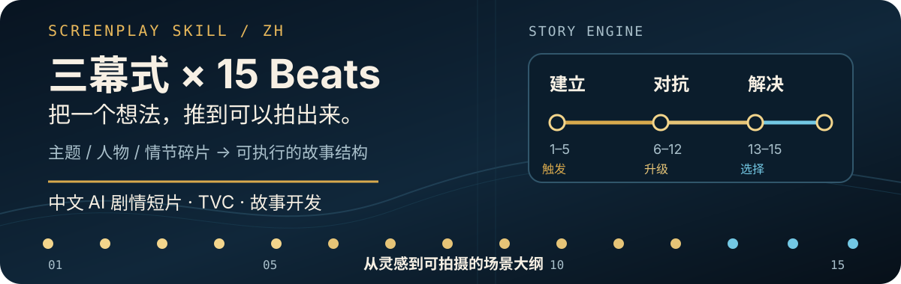
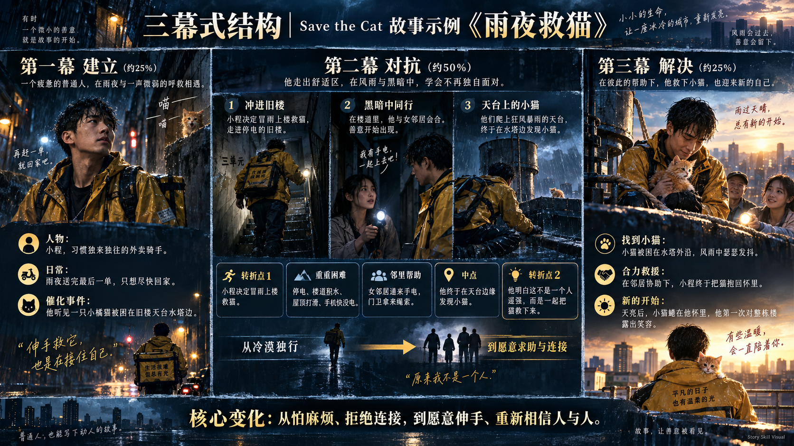
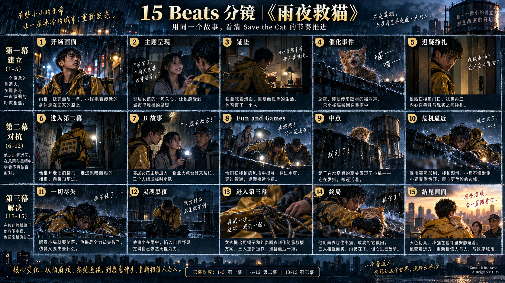

<p align="center">
  
</p>

# 中文剧本创作：三幕式 + 15 Beats

一个给中文创作者使用的 Codex Skill：把一句灵感、几个人物或一组画面，发展成**先能判断、再能展开、最后能拍**的故事结构。

你不需要先会写剧本。可以从一个主题开始，也可以只丢下一句“雨夜里有人听见猫叫”；skill 会先抓住故事发动机，再逐步推进到梗概、人物弧光、三幕式、15 Beats 和场景大纲。

仓库与调用名：`Ailuren-scriptwriter-3act-15beats`

> 默认方法：三幕式（建立 → 对抗 → 解决） + Save the Cat 15 Beats + 场景级剧情大纲

<p align="center">
  <a href="#真实输出-雨夜救猫">先看案例</a> ·
  <a href="#不会用照着这-4-步开始">立即使用</a> ·
  <a href="#创作边界">了解边界</a>
</p>

## 真实输出： 《雨夜救猫》

只展示一个完整案例，方便从文本一路看到结构和视觉结果。

### 文本

完整故事文本：[`examples/雨夜救猫.md`](./examples/雨夜救猫.md)

> 一个习惯独来独往、怕麻烦的外卖骑手，在暴雨夜听见旧楼天台传来小猫的求救声。为了救下一只被困在水塔边缘的橘猫，他不得不走进停电的旧楼、接受陌生人的帮助，并在一次看似微小的救援中重新学会相信人与人之间的连接。

**核心主题：** 愿意伸手帮助别人，也是在重新接住自己。

### 三幕式结构图

<p align="center">
  
</p>

### 15 Beats 分镜图

<p align="center">
  
</p>

## 先用 30 秒判断它适不适合你

| 你现在手里有什么 | 它会先帮你得到什么 |
| --- | --- |
| 一个主题或情绪 | 50–100 字故事梗概、看点和最大风险 |
| 一个角色或几个画面 | 故事发动机、目标、阻碍和可选方向 |
| 一个已经写散的故事 | 冲突升级、转折、反转和结局的结构诊断 |
| 一个品牌或产品 brief | 先读完资料，再把产品能力接进人物行动和剧情因果 |

新故事默认不会一上来堆满 15 Beats。先判断“这个故事值不值得继续”，确认方向后再展开完整结构。

## 它解决什么问题

很多故事不是没有画面，而是缺少一条能持续推进的因果线。这个 skill 会先找到故事发动机，再把素材放进结构里：

```text
主角 + 外在目标 + 内在需求 + 阻碍 + 风险
                              ↓
             三幕式骨架 + 15 个剧情功能
                              ↓
                  可执行的场景级剧情大纲
```

它尤其适合：

- AI 剧情短片与分镜前期开发
- 广告、TVC 与品牌故事；品牌 TVC 默认写消费者处境中的品牌广告成片，不写广告制作幕后
- 只有主题、人物或几个画面时的故事起稿
- 已有剧情但中段松散、转折不足、结尾无力的结构重写

## 核心方法

### 三幕式：控制故事的方向

| 幕 | 任务 | 关键检查 |
| --- | --- | --- |
| 第一幕｜建立 | 建立人物、世界、欲望与缺陷，完成催化事件 | 主角为什么现在必须行动？ |
| 第二幕｜对抗 | 展开行动、关系线与核心卖点，持续升级压力 | 中点是否改变了游戏规则？ |
| 第三幕｜解决 | 从失败或主题线获得新认识，用行动完成高潮 | 结尾是否证明人物已经改变？ |

### 15 Beats：控制转折，不制造 15 个镜头

15 Beats 是剧情功能，不要求 15 个独立场景。短片可以压缩和合并，但必须保留关键的因果关系：

```text
01 开场画面 → 02 主题呈现 → 03 铺垫 → 04 催化事件 → 05 迟疑挣扎
06 进入第二幕 → 07 B 故事 → 08 核心展开 → 09 中点 → 10 危机逼近
11 一切尽失 → 12 灵魂黑夜 → 13 进入第三幕 → 14 终局 → 15 结尾画面
```

完整节拍定义在 [`references/beat-sheet.md`](./references/beat-sheet.md)，默认交付格式在 [`references/output-template.md`](./references/output-template.md)。

## 使用方式

安装完成后，在对话中调用：

```text
$Ailuren-scriptwriter-3act-15beats

我想写一个关于“重新相信别人”的短片：
- 主角：一个习惯独来独往的外卖骑手
- 画面：雨夜、旧楼、天台上的猫叫
- 结尾：温暖，但不要落入普通的“好人有好报”

请先不要展开完整剧本，只输出：
1. 50–100 字故事梗概
2. 这个故事最值得看的地方
3. 当前最像模板的风险
4. 三个不同的钩子 / 冲突 / 结局方向
保留已有题材、主角和核心创意，不要擅自换题。
```

如果你只有一个模糊想法，也可以直接说：

```text
我想写一个雨夜救猫的短片，主角是怕麻烦的外卖骑手，结尾希望有温暖的反转。
```

信息不完整时，skill 会保留已有设定，只补充让因果成立所必需的内容，并把关键补充列为“创作假设”。品牌广告任务中，优先补齐消费者处境、具体事件和产品行动，不擅自补成“主角正在拍广告”。

如果你明确要做品牌广告 / TVC，可以再补充品牌、产品能力、受众和硬性规范。skill 会把产品放进故事发动机，而不是最后硬插一个产品特写：

```text
我想做一支品牌 TVC。
- 品牌 / 产品：（填写）
- 观众正在面对的具体问题：（填写）
- 已确认的产品能力：（填写）
- 必须遵守的品牌或投稿规则：（粘贴资料）

请先完整读取资料，再输出品牌事件、前 3 秒钩子、产品因果和成片方案。
没有官方确认的参数不要改写成绝对承诺，并标出需要品牌方确认的内容。
```

## 不会用？照着这 4 步开始

### 第 1 步：Codex 一键安装（推荐）

在新的 Codex 对话中，复制下面整段并发送。`skill-installer` 会从公开 GitHub 仓库读取根目录的 `SKILL.md` 和 `references/`：

```text
$skill-installer

请从这个公开 GitHub 仓库安装 Codex skill：
https://github.com/Ai-luren/Ailuren-scriptwriter-3act-15beats

请安装仓库根目录的 skill，安装名使用：Ailuren-scriptwriter-3act-15beats
安装完成后告诉我安装路径。
```

安装完成后，在新的 Codex 对话中输入 `$Ailuren-scriptwriter-3act-15beats` 即可调用。

### 手动安装（备用）

把仓库里的 `SKILL.md` 和 `references/` 文件夹复制到 Codex 的 skills 目录：

```bash
mkdir -p ~/.codex/skills/Ailuren-scriptwriter-3act-15beats/references
cp SKILL.md ~/.codex/skills/Ailuren-scriptwriter-3act-15beats/
cp references/*.md ~/.codex/skills/Ailuren-scriptwriter-3act-15beats/references/
```

### 第 2 步：不会写提示词，就先填 4 个空

直接复制下面这段，把括号里的内容换成你的想法：

```text
$Ailuren-scriptwriter-3act-15beats

帮我把这个想法发展成一个故事：
- 主角：（谁）
- 他/她想要：（外在目标）
- 最大阻碍：（什么在阻止他/她）
- 我想表达：（主题或情绪）

请先只输出：
1. 50–100 字故事梗概
2. 为什么值得看
3. 当前最大风险
4. 三个可选的钩子、冲突或结局方向
不要直接展开完整剧本；如果信息不足，请做最少必要补充，并列出创作假设。
```

选定方向后，再发送：

```text
采用方案 2。保留主题、主角和核心创意，展开人物弧光、三幕式、15 Beats 和场景级剧情大纲。
```

### 第 3 步：只有一个画面也可以

例如你只想到“雨夜、一个外卖骑手、一只被困的猫”，可以这样说：

```text
$Ailuren-scriptwriter-3act-15beats

我只有一个画面：雨夜里，一个外卖骑手听见旧楼楼顶有猫叫。
请帮我补成一个 3 分钟的温暖短片，主角一开始怕麻烦、拒绝和人连接，
结尾希望他在邻居帮助下救出小猫，也重新相信人与人之间的善意。
```

### 第 4 步：结果不满意，就指定一处修改

不需要重新描述整个故事，直接指出要改哪里：

```text
保留人物和结局，但把中点改得更有冲击力；
让一切尽失比中点更严重；
再输出修改后的 15 Beats 和受影响的场景大纲。
```

建议第一次先看“梗概、看点和风险”，确认故事真的有吸引力，再继续修改节拍和场景。不要一开始就要求完整对白，否则结构还没稳定就会过早进入写作细节。

更完整的操作说明见 [`docs/getting-started.md`](./docs/getting-started.md)。

## 完整案例

| 示例 | 适合观察的部分 | 文件 |
| --- | --- | --- |
| 《雨夜救猫》 | 小人物弧光、B 故事、15 Beats 到分镜 | [`examples/雨夜救猫.md`](./examples/雨夜救猫.md) |

图片统一放在 [`assets/examples/`](./assets/examples/)；README 只展示这个案例，避免多个案例抢夺阅读焦点。

## 创作边界

- 15 Beats 是检查故事功能的工具，不是公式化的 15 镜头清单。
- 不会为了套结构推翻用户最重要的创意。
- 高潮应由主角做出关键选择，不能靠突然出现的新能力或新人物解决。
- AI 视频适配会优先控制角色、场景、道具和动作的连续性；除非用户要求，不自动生成图像或视频提示词。
- 用户说“品牌广告 / TVC”时，默认主角是消费者或产品用户；只有明确要求幕后、导演阐述或元广告时，才写广告制作过程。
- 品牌广告的前 3 秒必须先发生具体事件，不用片名、brief、创意会议、打开软件或产品空镜代替钩子。
- 产品、主题和人物行动必须形成因果链：人物处境 → 产品能力 → 关键行动 → 剧情改变 → 主题落点；不能只在片尾喊口号。
- 产品参数中的“约”“最高”“最长”或性能比较，不会被擅自改写成绝对承诺；未确认资料优先使用“轻薄、持久、高效、流畅”等非量化表达，并标注需要官方确认。

## 文件结构

```text
.
├── SKILL.md                         # skill 主规则
├── references/
│   ├── beat-sheet.md                # 15 Beats 定义与时长压缩
│   ├── beginner-mode.md             # 新手模式与多轮共创
│   ├── brand-brief-checklist.md     # 品牌资料读取与参数边界
│   ├── hit-retention-audit.md       # 完播、互动与产品因果审核
│   ├── output-template.md           # 默认交付模板
│   └── story-interest-audit.md      # 钩子、冲突、升级与反转审核
├── docs/getting-started.md          # 从安装到第一次使用
├── assets/readme/hero.svg           # README 首屏视觉
├── assets/examples/                 # 案例结构图与分镜图
└── examples/                        # 所有案例文本
```

## License

本项目由 @Ai路人 创建与维护。

## 验证

README 的图片、SVG 和替代文本可用以下命令检查：

```bash
python3 /Users/ailuren/.codex/skills/beautify-github-readme/scripts/audit_readme.py README.md
git diff --check
```

本 README 的视觉素材使用现有案例，不依赖远程图片、外部字体或动态徽章。
